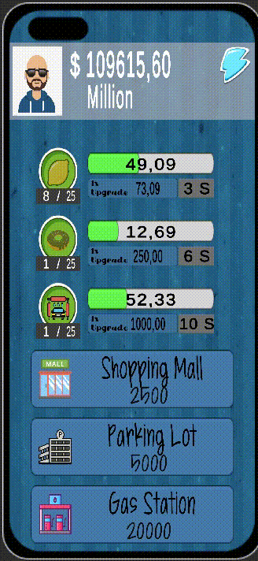

# Idle Clicker Game

This Unity project demonstrates the implementation of an incremental game featuring a block-based system. Each block operates independently, and the game manager controls various aspects such as upgrades, activations, and savings.

## Files and Scripts

### 1. BlockSystem.cs
   - Represents a block in the game.
   - Functions:
     - `IconButton()`: Initiates a countdown timer when the block's icon button is pressed.
     - `UpgradeButton()`: Handles the logic when the upgrade button is pressed.
     - `ActivationButton()`: Activates the block using the activation button.
     - `Managing()`: Coroutine for managing the countdown timer.
     - `ManagerBuy()`: Buys a manager for the block.
     - `Initialising()`: Initializes the block's components.
     - `SaveData(string fileName)`: Saves block-specific data to a JSON file.
     - `LoadData(string fileName)`: Loads block-specific data from a JSON file.
     - `ReopenApp()`: Calculates income for the block when the app is reopened.

### 2. TimeManager.cs
   - Manages the time-related aspects of the game, such as calculating the time the app was closed and the time it was reopened.

### 3. GameManager.cs
   - Manages the overall game state, including the main balance, block lists, and income calculation.
   - Functions:
     - `ManagerPanelButton()`: Shows the manager panel.
     - `ManagerPnlExitButton()`: Exits the manager panel.
     - `BlockBalanceUpdate(BlockSystem block)`: Updates the balance for a specific block.
     - `BlockUpdate()`: Updates all blocks in the game.
     - `MainBalanceUpdate()`: Updates the main balance UI.
     - `LoadGame()`: Loads the game state.
     - `IncomeCalculator()`: Calculates income based on active blocks.
     - `ComeBackAcceptButton()`: Handles the acceptance of income after reopening the app.

## How to Use

1. Attach the necessary scripts to relevant GameObjects in your Unity scene.
2. Set up the UI elements and buttons as desired.
3. Run the scene to play the incremental game.

## License

This project is licensed under the MIT License - see the [LICENSE](LICENSE) file for details.

---

**Note:** This README file is an example. You can customize it by adding specific information about your project. Adjust the screenshot file names and paths according to your project structure.
